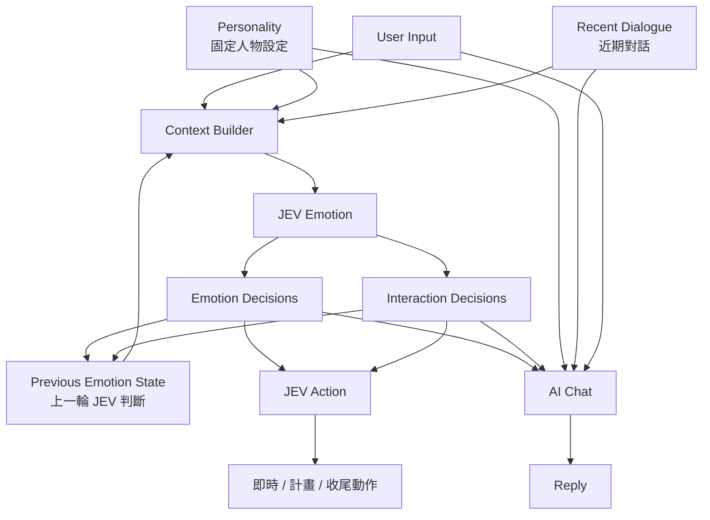

# AI_VT 情緒系統定案：JEV Structured Emotion State

## 1. 核心結論

AI_VT 不再維護 `jpaf_session`，也不要求 JEV 生成：

```text
Current emotional state:
「害羞正在下降，仍有一點開心……」
```

這類自由文字情緒描述。

新的原則：

> **JEV 負責快速判斷少量、可直接使用的情緒與互動傾向；後端只保存上一輪 JEV 判斷結果；AI Chat 與 JEV Action 直接讀取這些結果。**

主 Chat LLM 不負責維護情緒狀態，也不輸出任何 state update。

---

# 2. 最終流程

```text
User Input
   │
   ▼
Context Builder
   │
   ├─ Personality
   ├─ Recent Dialogue
   └─ Previous Emotion State
   │
   ▼
JEV Emotion
   │
   ├─ Emotion Decisions
   └─ Interaction Decisions
   │
   ├──────────────────────┐
   ▼                      ▼
JEV Action              AI Chat
   │                      │
   ▼                      ▼
即時 / 計畫 / 收尾動作     Reply
```

核心資料流：

```text
短期對話
+
固定人物設定
+
上一輪情緒判斷
+
最新訊息
        ↓
    JEV Emotion
        ↓
結構化情緒判斷
   ↙           ↘
JEV Action     AI Chat
```

---

# 3. 不使用長期記憶做情緒判斷

Emotion JEV 不從：

```text
Long-term Memory
Vector DB
Memory Retrieval
```

主動搜尋資料。

原因：

- 當下情緒主要由近期互動決定。
- 長期記憶容易把無關資料帶進情緒判斷。
- Retrieval 增加延遲與系統複雜度。
- AI VT 的即時反應應保持快速。
- 真正影響當下的資訊通常已存在近期對話。

因此 Emotion JEV 的 Context 只需要：

```text
Personality
+
Recent Dialogue
+
Previous Emotion State
+
Current User Input
```

---

# 4. Personality — 固定人物設定

`Personality` 是固定 Character Card。

例如：

```yaml
personality:
  name: 露西亞
  traits:
    - 嘴硬
    - 容易害羞
    - 不喜歡直接承認親密情緒
    - 熟人面前喜歡吐槽
    - 真正生氣時反而話會變少
```

Personality 不由 JEV 產生，也不需要每輪更新。

它的作用是讓 JEV 理解：

> 同樣的事件，這個角色通常會如何感受與互動。

例如：

```text
被稱讚

一般角色
→ 直接開心

露西亞
→ 害羞 + 開心 + 掩飾 + 嘴硬
```

---

# 5. Recent Dialogue — 短期對話

保存最近幾輪真實對話。

建議：

```text
5～12 turns
```

視 Context 長度與延遲調整。

例如：

```text
User: 妳今天怎麼那麼可愛
AI: 哈？突然講什麼啦
User: 因為真的很可愛啊
AI: 你很煩欸……
User: 好啦不鬧妳，今天工作怎樣？
```

這是 JEV Emotion 最主要的判斷依據。

---

# 6. Previous Emotion State — 取代 Emotion Memory / Inner Note

不再保存：

```text
「剛被稱讚，明顯害羞但其實很開心。」
「害羞正在下降，仍然有點開心。」
```

這類自然語言 Emotion Memory。

也不再維護：

```text
Inner Note
人物小自白
```

改成只保存上一輪 JEV 的結構化結果。

例如：

```json
{
  "shy": 0.82,
  "pleased": 0.74,
  "genuinely_angry": 0.08,
  "masking_positive_feeling": 0.79,
  "wants_continue_interaction": 0.88
}
```

下一輪直接把這份 state 與新對話一起交回 JEV。

因此：

```text
Emotion(t-1)
+
Recent Dialogue
+
Current User Input
        ↓
       JEV
        ↓
Emotion(t)
```

情緒連續性由 JEV 根據上一輪 state 與新 Context 自行判斷。

Backend 不需要：

```text
decay
arousal *= 0.8
embarrassment -= 0.2
```

---

# 7. JEV Emotion 不輸出自由文字

舊版：

```json
{
  "current_emotional_state": "害羞正在下降，仍然有點開心和嘴硬，沒有真正生氣。",
  "interaction_tendency": "想恢復正常聊天，但仍會保留一點吐槽感。",
  "inner_note": "剛剛確實有被說得有點害羞，不過現在不用再一直糾結這件事。"
}
```

這一版取消。

原因：

JEV 更適合：

```text
Choice
Score
Noul / probability
```

而不是自由生成一段中文心理描述。

新的輸出只保留可直接使用的 decision。

例如：

```json
{
  "shy": 0.38,
  "pleased": 0.62,
  "genuinely_angry": 0.04,
  "masking_positive_feeling": 0.31,
  "wants_continue_interaction": 0.87
}
```

---

# 8. 情緒判斷不要互斥

不要設計成：

```text
emotion =
happy | sad | angry | shy | neutral
```

因為角色可以同時：

```text
開心
+
害羞
+
有一點不爽
+
想掩飾
+
又想繼續互動
```

因此 JEV Emotion 應拆成數個獨立問題。

例如：

```text
她現在有明顯害羞嗎？
她現在因為互動感到開心嗎？
她現在是真的生氣嗎？
她正在掩飾正面情緒嗎？
她希望目前互動繼續嗎？
```

每個問題獨立輸出 probability。

---

# 9. 第一版建議欄位

先不要做太多。

建議第一版只有：

```yaml
emotion:
  shy:
  pleased:
  genuinely_angry:
  sad_or_hurt:

interaction:
  masking_positive_feeling:
  wants_continue_interaction:
```

例如：

```json
{
  "shy": 0.81,
  "pleased": 0.77,
  "genuinely_angry": 0.09,
  "sad_or_hurt": 0.03,
  "masking_positive_feeling": 0.84,
  "wants_continue_interaction": 0.91
}
```

這 6 個欄位已經足以表現大量 VT 對話狀態。

之後真的需要再增加：

```text
jealous
afraid
excited
wants_distance
wants_attention
playful
```

不要一開始就做十幾二十種 Emotion State。

---

# 10. 情緒變動怎麼處理？

範例：

## Turn 1

User：

```text
妳今天真的超可愛。
```

JEV：

```json
{
  "shy": 0.91,
  "pleased": 0.85,
  "genuinely_angry": 0.07,
  "sad_or_hurt": 0.01,
  "masking_positive_feeling": 0.88,
  "wants_continue_interaction": 0.83
}
```

---

## Turn 2

AI：

```text
哈？你今天到底怎麼回事啦……
```

User：

```text
好啦不逗妳了，今天事情做完了嗎？
```

輸入給 JEV：

```text
Previous Emotion State:
shy: 0.91
pleased: 0.85
genuinely_angry: 0.07
masking_positive_feeling: 0.88
wants_continue_interaction: 0.83

Recent Dialogue:
...

Current User:
好啦不逗妳了，今天事情做完了嗎？
```

JEV 新判斷：

```json
{
  "shy": 0.34,
  "pleased": 0.59,
  "genuinely_angry": 0.03,
  "sad_or_hurt": 0.01,
  "masking_positive_feeling": 0.26,
  "wants_continue_interaction": 0.89
}
```

這就表示：

```text
害羞自然下降
正向情緒仍殘留
幾乎沒有真的生氣
互動意願仍然很高
```

但這句解釋只存在於人類理解。

系統本身不用生成這段話。

---

# 11. AI Chat 收到什麼？

AI Chat 直接收到：

```text
[Personality]
嘴硬、容易害羞、不直接承認親密感。

[Emotion]
害羞: 0.34
開心/正向: 0.59
真生氣: 0.03
受傷/難過: 0.01

[Interaction]
掩飾正面情緒: 0.26
希望繼續互動: 0.89

[Recent Dialogue]
...

[User]
好啦不逗妳了，今天事情做完了嗎？
```

Chat 模型自行理解：

```text
害羞已經不強
仍有一點開心
沒有真的生氣
可以恢復正常聊天
```

但 Chat 不需要輸出任何情緒資料。

唯一輸出：

```text
Reply
```

---

# 12. JEV Action 收到什麼？

JEV Action 與 Chat 共用同一份 Emotion State。

例如：

```text
shy: 0.34
pleased: 0.59
genuinely_angry: 0.03
masking_positive_feeling: 0.26
wants_continue_interaction: 0.89
```

再結合：

```text
Recent Dialogue
Current User Input
```

決定：

```json
{
  "immediate": "small_smile",
  "planned": "return_eye_contact",
  "ending": "neutral_idle"
}
```

因此：

```text
                 JEV Emotion
                     │
            Structured State
              ↙             ↘
       JEV Action          AI Chat
        怎麼演              怎麼說
```

兩邊對「角色現在的狀態」有一致來源。

---

# 13. Chat 不需要人物小自白

舊版設計：

```text
Inner Note:
其實被稱讚很開心，但我不想直接承認。
```

取消。

原因是 Chat LLM 本身就能從：

```text
shy = high
pleased = high
angry = low
masking = high
```

理解：

```text
「害羞開心但嘴硬」
```

沒有必要：

```text
JEV decision
→ 再轉自然語言 Inner Note
→ 再給 Chat 理解
```

直接：

```text
JEV decision
→ Chat
```

即可。

更少 latency，也更少資訊失真。

---

# 14. Backend 最終保存資料

非常少：

```json
{
  "recent_dialogue": [
    "...",
    "..."
  ],

  "previous_emotion_state": {
    "shy": 0.34,
    "pleased": 0.59,
    "genuinely_angry": 0.03,
    "sad_or_hurt": 0.01,
    "masking_positive_feeling": 0.26,
    "wants_continue_interaction": 0.89
  }
}
```

固定 Character Card：

```json
{
  "personality": {
    "name": "露西亞",
    "traits": [
      "嘴硬",
      "容易害羞",
      "不直接承認親密感"
    ]
  }
}
```

沒有：

```text
jpaf_session
Inner Note
Emotion Memory Queue
valence
arousal
affection_score
trust_score
人工 decay
人工 emotion rules
```

---

# 15. 最終架構



---

# 16. 各模組責任

| 模組 | 責任 |
|---|---|
| Personality | 固定角色人格與行為傾向 |
| Recent Dialogue | 保存最近幾輪原始對話 |
| Previous Emotion State | 保存上一輪 JEV decision |
| JEV Emotion | 根據 Context 更新情緒與互動 decision |
| JEV Action | 根據 Emotion State 決定 VT 動作 |
| AI Chat | 根據人物、情緒與對話自然回覆 |
| Backend | 保存 Context / Routing / 截斷，不理解情緒 |

---

# 17. 最重要的設計原則

## 1. JEV 判斷，不寫心理小作文

```text
❌ 害羞正在下降，仍有一點開心……

✅ shy = 0.34
✅ pleased = 0.59
✅ genuinely_angry = 0.03
```

---

## 2. Emotion State 可以混沌

不要求總和 = 1。

例如：

```text
shy       0.8
pleased   0.8
angry     0.2
```

完全合理。

---

## 3. 上一輪 state 只是 Context

不代表一定延續。

JEV 可以根據新事件快速改變：

```text
Emotion(t-1)
+
新對話
→
Emotion(t)
```

---

## 4. Backend 不模擬心理學

Backend 不處理：

```text
被稱讚 → shy + 0.2
30 秒 → shy - 0.1
```

它只保存 JEV 的上一輪結果。

---

## 5. Chat 保持最輕

Chat：

```text
Personality
+
Recent Dialogue
+
JEV Emotion State
+
User Input
        ↓
      Reply
```

沒有 state update。

---

# 18. 一句話版本

> **AI_VT 移除 jpaf、Emotion Memory 自然語言摘要與 Inner Note；改由 JEV 每輪根據 Personality、Recent Dialogue、Previous Emotion State 與最新輸入，產生少量結構化且可並存的情緒 / 互動 decision，再同時提供給 JEV Action 與 AI Chat。Chat 只負責自然回覆，Backend 只保存上一輪 decision。**

