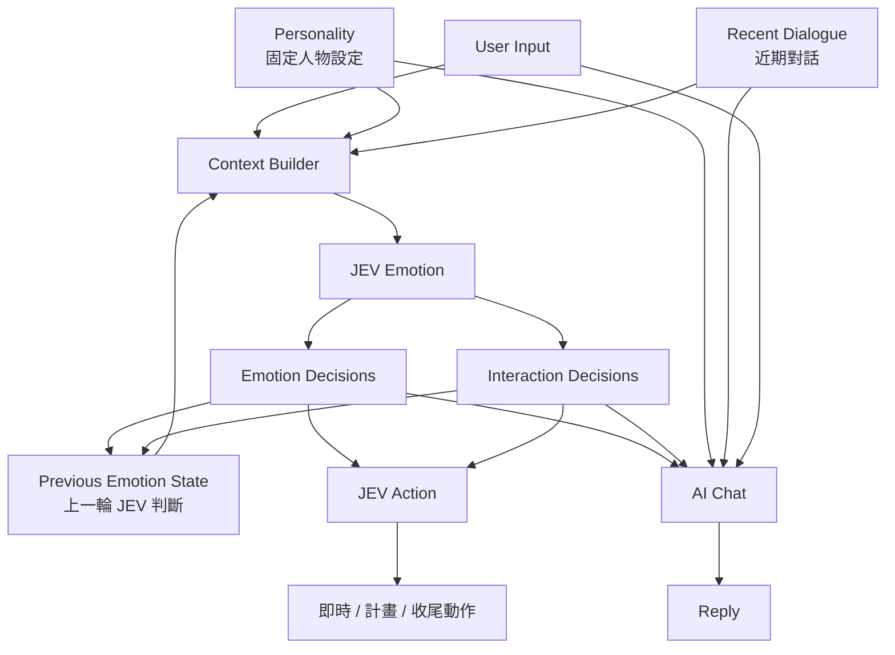

# AI_VT 情緒系統定案：JEV Structured Emotion State

# 1. 核心結論

AI_VT 不再維護 `jpaf_session`，也不要求 JEV 生成：

```text
Current emotional state:
「害羞正在下降，仍有一點開心……」
```

這類自由文字情緒描述。

新的原則：

> **JEV 負責快速判斷少量、可直接使用的情緒與互動傾向；後端只保存上一輪 JEV 判斷結果；AI Chat 與 JEV Action 直接讀取這些結果。**

主 Chat LLM 不負責維護情緒狀態，也不輸出任何 state update。

---

# 2. 最終流程

```text
User Input
   │
   ▼
Context Builder
   │
   ├─ Personality
   ├─ Recent Dialogue
   └─ Previous Emotion State
   │
   ▼
JEV Emotion
   │
   ├─ Emotion Decisions
   └─ Interaction Decisions
   │
   ├──────────────────────┐
   ▼                      ▼
JEV Action              AI Chat
   │                      │
   ▼                      ▼
即時 / 計畫 / 收尾動作     Reply
```

核心資料流：

```text
短期對話
+
固定人物設定
+
上一輪情緒判斷
+
最新訊息
        ↓
    JEV Emotion
        ↓
結構化情緒判斷
   ↙           ↘
JEV Action     AI Chat
```

---

# 3. 不使用長期記憶做情緒判斷

Emotion JEV 不從：

```text
Long-term Memory
Vector DB
Memory Retrieval
```

主動搜尋資料。

原因：

- 當下情緒主要由近期互動決定。
- 長期記憶容易把無關資料帶進情緒判斷。
- Retrieval 增加延遲與系統複雜度。
- AI VT 的即時反應應保持快速。
- 真正影響當下的資訊通常已存在近期對話。

因此 Emotion JEV 的 Context 只需要：

```text
Personality
+
Recent Dialogue
+
Previous Emotion State
+
Current User Input
```

---

# 4. Personality — 固定人物設定

`Personality` 是固定 Character Card，內容定案如下：

```yaml
personality:
  name: 露西亞
  traits:
    - 嘴硬
    - 容易害羞
    - 不喜歡直接承認親密情緒
    - 熟人面前喜歡吐槽
    - 真正生氣時反而話會變少
```

Personality 不由 JEV 產生，也不需要每輪更新。

它的作用是讓 JEV 理解：

> 同樣的事件，這個角色通常會如何感受與互動。

例如：

```text
被稱讚

一般角色
→ 直接開心

露西亞
→ 害羞 + 開心 + 掩飾 + 嘴硬
```

---

# 5. Recent Dialogue — 短期對話

保存最近 8 輪已完成的真實對話（每輪為一組 User / AI 訊息）。
`Current User Input` 必須獨立傳入，不重複放進 `Recent Dialogue`。
若未來要調整輪數，應以單一設定控制，不得由 Emotion、Action、Chat 各自截取不同範圍。

例如：

```text
User: 妳今天怎麼那麼可愛
AI: 哈？突然講什麼啦
User: 因為真的很可愛啊
AI: 你很煩欸……
User: 好啦不鬧妳，今天工作怎樣？
```

這是 JEV Emotion 最主要的判斷依據。

---

# 6. Previous Emotion State — 取代 Emotion Memory / Inner Note

不再保存：

```text
「剛被稱讚，明顯害羞但其實很開心。」
「害羞正在下降，仍然有點開心。」
```

這類自然語言 Emotion Memory。

也不再維護：

```text
Inner Note
人物小自白
```

改成只保存上一輪 JEV 的結構化結果。

例如：

```json
{
  "shy": 0.82,
  "pleased": 0.74,
  "genuinely_angry": 0.08,
  "sad_or_hurt": 0.02,
  "masking_positive_feeling": 0.79,
  "wants_continue_interaction": 0.88
}
```

下一輪直接把這份 state 與新對話一起交回 JEV。

因此：

```text
Emotion(t-1)
+
Recent Dialogue
+
Current User Input
        ↓
       JEV
        ↓
Emotion(t)
```

情緒連續性由 JEV 根據上一輪 state 與新 Context 自行判斷。

Backend 不需要：

```text
decay
arousal *= 0.8
embarrassment -= 0.2
```

---

# 7. JEV Emotion 不輸出自由文字

舊版：

```json
{
  "current_emotional_state": "害羞正在下降，仍然有點開心和嘴硬，沒有真正生氣。",
  "interaction_tendency": "想恢復正常聊天，但仍會保留一點吐槽感。",
  "inner_note": "剛剛確實有被說得有點害羞，不過現在不用再一直糾結這件事。"
}
```

這一版取消。

原因：

JEV 更適合：

```text
Choice
Score
Noul / probability
```

而不是自由生成一段中文心理描述。

新的輸出只保留可直接使用的 decision。

例如：

```json
{
  "shy": 0.38,
  "pleased": 0.62,
  "genuinely_angry": 0.04,
  "sad_or_hurt": 0.01,
  "masking_positive_feeling": 0.31,
  "wants_continue_interaction": 0.87
}
```

---

# 8. 情緒判斷不要互斥

不要設計成：

```text
emotion =
happy | sad | angry | shy | neutral
```

因為角色可以同時：

```text
開心
+
害羞
+
有一點不爽
+
想掩飾
+
又想繼續互動
```

因此 JEV Emotion 應拆成數個獨立問題。

例如：

```text
她現在有明顯害羞嗎？
她現在因為互動感到開心嗎？
她現在是真的生氣嗎？
她正在掩飾正面情緒嗎？
她希望目前互動繼續嗎？
```

每個問題獨立輸出 probability。

---

# 9. 第一版固定欄位

先不要做太多。

建議第一版只有：

```yaml
emotion:
  shy:
  pleased:
  genuinely_angry:
  sad_or_hurt:

interaction:
  masking_positive_feeling:
  wants_continue_interaction:
```

例如：

```json
{
  "shy": 0.81,
  "pleased": 0.77,
  "genuinely_angry": 0.09,
  "sad_or_hurt": 0.03,
  "masking_positive_feeling": 0.84,
  "wants_continue_interaction": 0.91
}
```

這 6 個欄位已經足以表現大量 VT 對話狀態。

之後真的需要再增加：

```text
jealous
afraid
excited
wants_distance
wants_attention
playful
```

不要一開始就做十幾二十種 Emotion State。

---

# 10. 情緒變動怎麼處理？

範例：

## Turn 1

User：

```text
妳今天真的超可愛。
```

JEV：

```json
{
  "shy": 0.91,
  "pleased": 0.85,
  "genuinely_angry": 0.07,
  "sad_or_hurt": 0.01,
  "masking_positive_feeling": 0.88,
  "wants_continue_interaction": 0.83
}
```

---

## Turn 2

AI：

```text
哈？你今天到底怎麼回事啦……
```

User：

```text
好啦不逗妳了，今天事情做完了嗎？
```

輸入給 JEV：

```text
Previous Emotion State:
shy: 0.91
pleased: 0.85
genuinely_angry: 0.07
sad_or_hurt: 0.01
masking_positive_feeling: 0.88
wants_continue_interaction: 0.83

Recent Dialogue:
...

Current User:
好啦不逗妳了，今天事情做完了嗎？
```

JEV 新判斷：

```json
{
  "shy": 0.34,
  "pleased": 0.59,
  "genuinely_angry": 0.03,
  "sad_or_hurt": 0.01,
  "masking_positive_feeling": 0.26,
  "wants_continue_interaction": 0.89
}
```

這就表示：

```text
害羞自然下降
正向情緒仍殘留
幾乎沒有真的生氣
互動意願仍然很高
```

但這句解釋只存在於人類理解。

系統本身不用生成這段話。

---

# 11. AI Chat 收到什麼？

AI Chat 直接收到：

```text
[Personality]
嘴硬、容易害羞、不直接承認親密感。

[Emotion]
害羞: 0.34
開心/正向: 0.59
真生氣: 0.03
受傷/難過: 0.01

[Interaction]
掩飾正面情緒: 0.26
希望繼續互動: 0.89

[Recent Dialogue]
...

[User]
好啦不逗妳了，今天事情做完了嗎？
```

Chat 模型自行理解：

```text
害羞已經不強
仍有一點開心
沒有真的生氣
可以恢復正常聊天
```

但 Chat 不需要輸出任何情緒資料。

唯一輸出：

```text
Reply
```

---

# 12. JEV Action 收到什麼？

JEV Action 與 Chat 共用同一份 Emotion State。

例如：

```text
shy: 0.34
pleased: 0.59
genuinely_angry: 0.03
sad_or_hurt: 0.01
masking_positive_feeling: 0.26
wants_continue_interaction: 0.89
```

再結合：

```text
Personality
Recent Dialogue
Current User Input
Previous Expression Carry State
```

產生現有 `expression_compiler` 可接受的 Expression Intent，例如：

```json
{
  "emotion": "shy",
  "secondary_emotion": "happy",
  "performance_mode": "awkward",
  "arc": "shrink_then_recover",
  "intensity": 0.58,
  "energy": 0.42,
  "blink_style": "shy_fast"
}
```

JEV Action 不建立第二份情緒狀態，也不回寫 Emotion State。它只回答「如何演」，
接著由既有 Expression Compiler 產生 `expression_plan`、blink plan、idle plan 與 legacy behavior payload。

因此：

```text
                 JEV Emotion
                     │
            Structured State
              ↙             ↘
       JEV Action          AI Chat
        怎麼演              怎麼說
```

兩邊對「角色現在的狀態」有一致來源。

---

# 13. Chat 不需要人物小自白

舊版設計：

```text
Inner Note:
其實被稱讚很開心，但我不想直接承認。
```

取消。

原因是 Chat LLM 本身就能從：

```text
shy = high
pleased = high
angry = low
masking = high
```

理解：

```text
「害羞開心但嘴硬」
```

沒有必要：

```text
JEV decision
→ 再轉自然語言 Inner Note
→ 再給 Chat 理解
```

直接：

```text
JEV decision
→ Chat
```

即可。

更少 latency，也更少資訊失真。

---

# 14. Backend 最終保存資料

非常少：

```json
{
  "recent_dialogue": [
    "...",
    "..."
  ],

  "previous_emotion_state": {
    "shy": 0.34,
    "pleased": 0.59,
    "genuinely_angry": 0.03,
    "sad_or_hurt": 0.01,
    "masking_positive_feeling": 0.26,
    "wants_continue_interaction": 0.89
  }
}
```

固定 Character Card：

```json
{
  "personality": {
    "name": "露西亞",
    "traits": [
      "嘴硬",
      "容易害羞",
      "不喜歡直接承認親密情緒",
      "熟人面前喜歡吐槽",
      "真正生氣時反而話會變少"
    ]
  }
}
```

沒有：

```text
jpaf_session
Inner Note
Emotion Memory Queue
valence
arousal
affection_score
trust_score
人工 decay
人工 emotion rules
```

---

# 15. 最終架構



---

# 16. 各模組責任

| 模組 | 責任 |
|---|---|
| Personality | 固定角色人格與行為傾向 |
| Recent Dialogue | 保存最近幾輪原始對話 |
| Previous Emotion State | 保存上一輪 JEV decision |
| JEV Emotion | 根據 Context 更新情緒與互動 decision |
| JEV Action | 根據 Emotion State 決定 VT 動作 |
| AI Chat | 根據人物、情緒與對話自然回覆 |
| Backend | 保存 Context、驗證契約、Routing、截斷；不推導或調整情緒 |

---

# 17. 最重要的設計原則

## 1. JEV 判斷，不寫心理小作文

```text
❌ 害羞正在下降，仍有一點開心……

✅ shy = 0.34
✅ pleased = 0.59
✅ genuinely_angry = 0.03
```

---

## 2. Emotion State 可以混沌

不要求總和 = 1。

例如：

```text
shy       0.8
pleased   0.8
angry     0.2
```

完全合理。

---

## 3. 上一輪 state 只是 Context

不代表一定延續。

JEV 可以根據新事件快速改變：

```text
Emotion(t-1)
+
新對話
→
Emotion(t)
```

---

## 4. Backend 不模擬心理學

Backend 不處理：

```text
被稱讚 → shy + 0.2
30 秒 → shy - 0.1
```

它只保存 JEV 的上一輪結果。

---

## 5. Chat 保持最輕

Chat：

```text
Personality
+
Recent Dialogue
+
JEV Emotion State
+
User Input
        ↓
      Reply
```

沒有 state update。

---

# 18. 一句話版本

> **AI_VT 移除 jpaf、Emotion Memory 自然語言摘要與 Inner Note；改由 JEV 每輪根據 Personality、Recent Dialogue、Previous Emotion State 與最新輸入，產生少量結構化且可並存的情緒 / 互動 decision，再同時提供給 JEV Action 與 AI Chat。Chat 只負責自然回覆，Backend 只保存上一輪 decision。**

---

# 19. 正式 Emotion State 契約

第一版 Emotion State 是一個封閉、完整、不可局部更新的 JSON object：

```json
{
  "shy": 0.0,
  "pleased": 0.0,
  "genuinely_angry": 0.0,
  "sad_or_hurt": 0.0,
  "masking_positive_feeling": 0.0,
  "wants_continue_interaction": 0.0
}
```

契約規則：

1. 六個欄位全部必填，不接受 partial update。
2. 每個值都是彼此獨立的 probability，範圍為 `0.0～1.0`，總和不必等於 1。
3. 不接受 `bool`、字串、`NaN`、無限值、超出範圍的數字或未定義欄位。
4. Backend 必須先完成整份驗證，成功後才能原子替換 previous state。
5. 契約中沒有主情緒、次情緒、自由文字、`inner_note`、`energy`、`intensity`、`pace` 或表情控制欄位。
6. Chat 與 JEV Action 必須取得同一份已驗證 state，不得各自重新推斷。

建議在 Backend 以單一 domain module 定義欄位集合、驗證、序列化與預設值，避免 Prompt、WebSocket、Store 與測試各自維護一份契約。

## JEV Emotion Questions

六個欄位分別對應六個獨立 Noul 問題：

| Question ID | 判斷內容 |
|---|---|
| `shy` | 露西亞此刻是否明顯害羞或不好意思 |
| `pleased` | 露西亞是否因目前互動感到開心、滿足或被取悅 |
| `genuinely_angry` | 露西亞是否真的生氣，而非嘴硬、吐槽或假裝不耐煩 |
| `sad_or_hurt` | 露西亞是否難過、失落、受傷或感到被冷落 |
| `masking_positive_feeling` | 露西亞是否正在掩飾喜歡、開心、親近等正面感受 |
| `wants_continue_interaction` | 露西亞是否希望目前話題或親密互動繼續 |

Question instructions 必須要求 JEV 同時考慮固定 Personality、最近 8 輪對話、上一輪 Emotion State 與最新使用者訊息；不得要求輸出自然語言理由。

---

# 20. 固定 Lucia Personality 契約

Personality 是程式中的單一固定設定，Emotion、Action 與 Chat 共用相同內容：

```yaml
personality:
  name: 露西亞
  traits:
    - 嘴硬
    - 容易害羞
    - 不喜歡直接承認親密情緒
    - 熟人面前喜歡吐槽
    - 真正生氣時反而話會變少
```

規則：

- Personality 不由模型產生、不隨回合更新，也不保存為情緒狀態。
- 不再存在 `current_persona`、`dominant`、`auxiliary`、Jungian function weights、Reflection 或 persona switch。
- User Profile 仍可保存「使用者是誰」的長期資訊，但不能覆寫露西亞的固定 Personality。
- Memory Agent 仍可管理一般共同回憶；Emotion JEV 不得讀取 User Profile、`memory.md`、Vector DB 或其他長期記憶。

---

# 21. 每輪執行順序與並行邊界

每輪必須依照以下順序：

```text
1. 收到 Current User Input
2. Context Builder 取得 Personality、Recent Dialogue、Previous Emotion State
3. 呼叫 JEV Emotion
4. 驗證並原子保存 Emotion State
5. 發送 emotion_update
6. 以同一份 Emotion State 平行啟動：
   ├─ AI Chat
   └─ JEV Action
7. JEV Action intent → Expression Compiler → expression_plan / behavior
8. AI Chat → 純文字 Reply
9. Reply 完成後執行 Memory Agent 與 TTS
10. 發送 stream_end
```

JEV Emotion 位於 Chat 的必要前置路徑，不能再與 Chat 同時啟動；否則 Chat 無法讀到本輪 Emotion State。
完成 Emotion State 後，Chat 與 JEV Action 可以平行執行，以限制新增延遲。

JEV Action 不需要等待 Chat Reply，也不能根據 Chat 自行生成的情緒標籤工作。它的輸入固定為：

```text
Personality
+
Recent Dialogue
+
Current User Input
+
Current Emotion State
+
Previous Expression Carry State
```

---

# 22. 持久化與 Session 邊界

Emotion State 必須以 chat session 為隔離單位：

- 每個 session 最多保存一份 `previous_emotion_state`。
- 切換 session 時必須載入目標 session 的 state，不能沿用目前連線中的 state。
- 啟用 chat persistence 時，Emotion State 隨 session 持久化並在重連後恢復。
- 持久化位置使用 `memory/emotion_states/{session_id}.json`，不改變既有 session message JSON 的 list schema。
- 未啟用 persistence 或沒有有效 session ID 時，只保留目前 WebSocket 連線內的 state。
- Reset 必須同時清除目前 session 的對話與 Emotion State。
- Emotion State 不寫進 `memory.md`、User Profile 或跨 session 的全域檔案。
- `jpaf_state.json` 停止進入讀取、寫入與 reset 路徑；遷移不需要拿舊 JPAF 值換算 Emotion State。

WebSocket 對前端發送：

```json
{
  "type": "emotion_update",
  "state": {
    "shy": 0.34,
    "pleased": 0.59,
    "genuinely_angry": 0.03,
    "sad_or_hurt": 0.01,
    "masking_positive_feeling": 0.26,
    "wants_continue_interaction": 0.89
  },
  "source": "jev"
}
```

`source` 只供觀測與除錯，不屬於 Emotion State：

```text
jev
previous_fallback
neutral_fallback
```

---

# 23. 失敗處理

## JEV Emotion 失敗

以下情況都視為整輪 Emotion decision 失敗：timeout、HTTP error、缺少 answers、缺欄位、非法型別、非有限數字、超出範圍或未知欄位。

處理規則：

1. 有 previous state：完整沿用 previous state，`source = previous_fallback`。
2. 沒有 previous state：使用中性預設值，`source = neutral_fallback`。
3. 不得呼叫 Chat、舊 Expression Agent 或規則關鍵字分類器補算情緒。
4. 不得把部分成功欄位和舊 state 拼成新 state。

中性預設值：

```json
{
  "shy": 0.0,
  "pleased": 0.0,
  "genuinely_angry": 0.0,
  "sad_or_hurt": 0.0,
  "masking_positive_feeling": 0.0,
  "wants_continue_interaction": 0.5
}
```

## JEV Action 失敗

- 不啟用舊 LLM Expression Agent。
- 有 Previous Expression Carry State 時交由 compiler 延續既有狀態。
- 首輪沒有 carry state 時產生 neutral expression plan。
- Action 失敗不回滾已成功保存的 Emotion State，也不阻止 Chat 回覆。

## Chat 或 Memory Agent 失敗

沿用既有 WebSocket error handling。Emotion State 是本輪已完成的 decision，不因下游失敗而回滾。

---

# 24. 現行系統遷移範圍

## Backend

| 區域 | 調整 |
|---|---|
| `domain/emotion_state.py` | 新增固定 Personality、六欄位契約、驗證、序列化與 neutral fallback |
| `domain/jev_questions.py` | 拆分 Emotion questions 與 Action questions；移除 JPAF／Chat emotion 輸入 |
| `domain/agent_a_prompts.py` | 改為固定露西亞 Personality + Current Emotion State；Chat 只輸出 Reply |
| `services/chat_service.py` | 移除 JPAF／Emotion XML 解析與舊 Expression Agent call，保留純文字 Chat、Memory、TTS |
| `api/routes/chat_ws.py` | 實作 JEV Emotion 前置、Chat/Action 平行與 `emotion_update`；移除所有決策分支 |
| `infrastructure/memory_store.py` | 新增 session Emotion State 讀寫/reset；移除 JPAF state 執行路徑 |
| `api/routes/memory_router.py` | Reset 改為清除 session Emotion State，不再 reset JPAF |
| `core/config.py` | 移除 `EXPRESSION_DECIDER`；JEV 改成唯一且必要的情緒服務 |
| Expression Compiler | 保持 public entry point 與既有 `expression_plan` 契約 |
| `tools/chat_test_cli.py` | 改報告六欄位 Emotion State，不再分析 JPAF persona/weights |

`domain/jpaf.py`、JPAF prompt、`<jpaf_state>`／`<emotion_state>` parser、舊 `call_expression_agent()` 與相關測試在無引用後移除。
`agent_b_prompts.py` 若仍承載 Memory Agent prompt，只移除 Expression Agent 部分，不影響 Memory Agent。

不再保留：

```text
EXPRESSION_DECIDER=llm
EXPRESSION_DECIDER=jev
舊 Expression Agent fallback
Chat <emotion_state>
Chat <jpaf_state>
direct keyword expression override
jpaf_update WebSocket event
```

## Frontend

| 區域 | 調整 |
|---|---|
| WebSocket service | 加入 `emotion_update` 的 runtime type guard，移除 `jpaf_update` handler |
| Zustand store | `jpafState` 改為六欄位 `emotionState` |
| Sidebar | JPAF 面板改為「露西亞情緒」面板，顯示六個即時分數與資料來源 |
| Reset UI | 文案改為清除記憶、對話與情緒狀態 |

Live2D runtime、`LAppModel.update()`、Cubism framework 與 `expression_plan` 前端執行順序不在本次遷移範圍內。

---

# 25. 測試與驗收

## 單元測試

- Emotion State 六欄位完整性、範圍、非法型別、未知欄位與原子 fallback。
- JEV Emotion questions 恰好對應六個契約欄位。
- Context Builder 只提供 Personality、最近 8 輪、previous state 與 current input。
- Context 中不存在 User Profile、memory notes、JPAF、Inner Note 或自由文字情緒摘要。
- Chat prompt 包含固定露西亞 Personality 與 Current Emotion State，但不要求任何 state output。
- JEV Action mapper 仍產生 compiler 可接受的 expression intent。

## 整合測試

- Chat 與 JEV Action 收到完全相同的 Emotion State。
- WebSocket 每輪只發送一次 `emotion_update`，且不再發送 `jpaf_update`。
- JEV Emotion 完成後才啟動 Chat；Emotion 完成後 Chat 與 Action 可並行。
- Emotion timeout／畸形回應分別走 previous 或 neutral fallback。
- Action timeout 不啟動舊 Expression Agent，Chat 仍可完成。
- session 切換、重連與 reset 不造成 Emotion State 串用。
- 原有 expression compiler、blink、idle、behavior 與 TTS 流程維持可用。

## 前端驗證

- 非法 `emotion_update` 不寫入 Store。
- 合法更新能正確顯示六個分數與 source。
- 移除 JPAF 型別、handler 與 UI 後沒有 orphaned imports 或 dead state。
- 執行 expression plan smoke test、TypeScript build 與 lint。

## 驗收條件

完成後，程式碼搜尋不得再出現會參與 runtime 的：

```text
EXPRESSION_DECIDER
call_expression_agent
<emotion_state>
<jpaf_state>
jpaf_update
load_jpaf_state
save_jpaf_state
```

歷史文件或未被載入的舊資料檔可保留，但必須明確退出 runtime 路徑。

---

# 26. 已決定事項與非目標

已決定：

- JEV 是唯一情緒來源。
- 不保留 LLM Expression Agent fallback。
- Personality 固定為露西亞的五項 traits。
- Emotion State 第一版只使用六個欄位。
- JEV Emotion 與 JEV Action 是兩個責任分離的階段。
- 前端以 Emotion 面板取代 JPAF 面板。

非目標：

- 不新增第二套心理狀態、人工 decay、情緒規則引擎或長期 Emotion Memory。
- 不修改 Live2D compiler 的 public contract。
- 不改寫 `LAppModel.update()` 或 Cubism SDK。
- 不在第一版加入 jealousy、fear、attention 等額外欄位。
